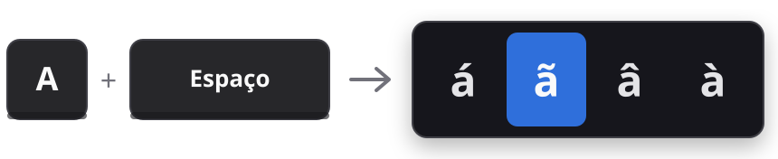

<p align="center">
  
</p>

<h1 align="center">AcentoRust</h1>

<p align="center">
  <b>Acentos em qualquer programa do Windows: segure a letra, toque Espaço, escolha.</b><br>
  Um clone minimalista do Acento Rápido do PowerToys, escrito em Rust puro sobre a API Win32.
</p>

<p align="center">
  <a href="https://github.com/armitagethird/acentorust/releases/latest"></a>
  
  
  
  
  <a href="LICENSE"></a>
</p>

<p align="center">
  <a href="https://github.com/armitagethird/acentorust/releases/latest/download/acentorust.exe"><b>Baixar acentorust.exe</b></a>
  &nbsp;·&nbsp;
  <a href="https://github.com/armitagethird/acentorust/releases">Todas as versões</a>
</p>

<p align="center">
  
</p>

---

## Por que existe

O PowerToys é ótimo, mas carrega dezenas de ferramentas para quem só quer digitar `ã` num teclado sem acentos. O AcentoRust faz **uma coisa só** e some do caminho:

| | |
|---|---|
| **Tamanho** | um único `.exe` de 154 KB, sem instalador |
| **Memória** | ~2,6 MB de RAM privada |
| **CPU parado** | 0% (a thread dorme até você tocar numa tecla) |
| **Dependências em tempo de execução** | nenhuma além das DLLs do próprio Windows |

## Como usar

| Você faz | Acontece |
|---|---|
| Segura `a`, `e`, `i`, `o`, `u` ou `c` e toca **Espaço** | a barra aparece no topo da tela |
| **Espaço** ou **→** | próxima opção |
| **←** | opção anterior |
| **Solta a letra** | a letra digitada vira o acento escolhido |
| **Esc** | fecha a barra e mantém a letra |
| **Shift** ou **Caps Lock** ativos | maiúsculas (`Á`, `Ç`...) |

Digitar rápido nunca dispara a barra: se você soltar a letra antes de 200 ms, o Espaço é digitado normalmente.

### Acentos disponíveis

Ordenados pela frequência em português, para que os mais usados precisem de menos toques.

| Letra | Opções |
|:---:|---|
| `a` | á · ã · â · à |
| `e` | é · ê |
| `i` | í |
| `o` | ó · õ · ô |
| `u` | ú |
| `c` | ç |

## Instalação

1. [Baixe o `acentorust.exe`](https://github.com/armitagethird/acentorust/releases/latest/download/acentorust.exe).
2. Guarde-o numa pasta fixa, por exemplo `%LOCALAPPDATA%\Programs\AcentoRust\`.
3. Execute. O ícone **á** aparece na bandeja, perto do relógio.
4. Clique no ícone e marque **Iniciar com o Windows**.

> [!IMPORTANT]
> O executável **não tem assinatura digital** (certificados de assinatura são pagos). Por isso o Windows pode desconfiar:
> - **SmartScreen:** clique em *Mais informações* → *Executar assim mesmo*.
> - **Smart App Control:** se estiver ligado, ele pode bloquear o arquivo. A alternativa é compilar você mesmo (veja abaixo).
>
> Confira se o arquivo é o original comparando o SHA-256 publicado na página da versão:
> ```powershell
> Get-FileHash .\acentorust.exe -Algorithm SHA256
> ```

> [!TIP]
> Se você usa o Acento Rápido do PowerToys, desative-o para os dois não disputarem o teclado.

## Feito para não atrapalhar

Um programa que intercepta o teclado não pode errar. As proteções:

- **Digitação rápida:** `a↓ Espaço↓ a↑` em menos de 200 ms é tratado como texto normal. O Espaço é reenviado, na ordem certa, e nada é trocado.
- **Jogos em tela cheia:** com um jogo ou vídeo ocupando a tela, o AcentoRust não intercepta nada. Segurar `A` e pular com Espaço continua funcionando.
- **Atalhos:** com Ctrl, Alt ou Win pressionados, nada acontece (inclui AltGr).
- **Tecla "perdida":** se o Windows engolir a soltura da letra (janela de administrador, UAC, tela de bloqueio), a sessão é validada a cada tecla e a cada 200 ms e se fecha sozinha.
- **Nunca trava o teclado:** se o processo cair, o Windows remove o hook e o teclado segue normal. O código usa `panic = "abort"` justamente para isso.
- **Sem eco:** teclas geradas por software, inclusive as nossas, passam direto.
- **Resiliente:** instância única, ícone restaurado se o Explorer reiniciar, bandeja tolerante a um logon lento e hook reinstalado ao voltar da suspensão.

## Privacidade

- Nenhuma tecla é gravada, registrada em log ou enviada para lugar nenhum. O programa **não usa rede**.
- O único estado guardado é a letra que você está segurando, e só enquanto a segura.
- O único dado persistido é a opção *Iniciar com o Windows*, uma entrada em `HKCU\Software\Microsoft\Windows\CurrentVersion\Run`.

## Compilar a partir do código

Requer [Rust](https://rustup.rs) estável com o toolchain MSVC.

```powershell
git clone https://github.com/armitagethird/acentorust
cd acentorust
cargo build --release
# resultado: target\release\acentorust.exe
```

```powershell
cargo test                                   # 48 testes
cargo clippy --all-targets -- -D warnings    # lint sem avisos
```

## Como funciona

A lógica fica numa **máquina de estados pura** (`engine.rs`), sem nenhuma chamada ao Windows e coberta por testes. Todo o resto são camadas finas sobre a Win32, rodando numa única thread:

```
teclado → hook WH_KEYBOARD_LL → engine: bloquear ou deixar passar? (+ no máximo 1 ação)
                                  └─ ação → fila → loop de mensagens → barra / timer / SendInput
```

O hook só decide e enfileira. Desenhar e inserir o caractere acontece fora dele, porque o Windows desliga em silêncio hooks que demoram.

| Arquivo | Papel |
|---|---|
| `src/engine.rs` | máquina de estados: `Idle → Held → Active` |
| `src/accents.rs` | tabela de acentos |
| `src/hook.rs` | hook de teclado de baixo nível |
| `src/popup.rs` | a barra: janela GDI que nunca rouba o foco, ajustada ao DPI |
| `src/input.rs` | `SendInput`: Backspace + caractere Unicode |
| `src/tray.rs` | ícone da bandeja (desenhado em tempo de execução) e menu |
| `src/autostart.rs` | opção *Iniciar com o Windows* |
| `src/main.rs` | instância única, loop de mensagens, fila de ações |

Dependências de compilação: [`windows-sys`](https://crates.io/crates/windows-sys), com os bindings oficiais da Microsoft, e [`anyhow`](https://crates.io/crates/anyhow).

## Limitações

- Não funciona dentro de programas abertos como administrador, na tela de bloqueio nem no UAC (limitação do Windows; o PowerToys tem a mesma). Nesses lugares o teclado continua normal.
- Só as letras do português.
- Alguns jogos e aplicativos antigos ignoram caracteres Unicode injetados.
- Se você segurar a letra além do tempo de repetição do Windows antes do Espaço, as letras repetidas ficam no texto e só a última é trocada.

## Desinstalar

Clique no ícone da bandeja, desmarque **Iniciar com o Windows**, clique em **Sair** e apague o `.exe`. Não sobra mais nada.

## Licença

[MIT](LICENSE) © 2026 Romero Saraiva
